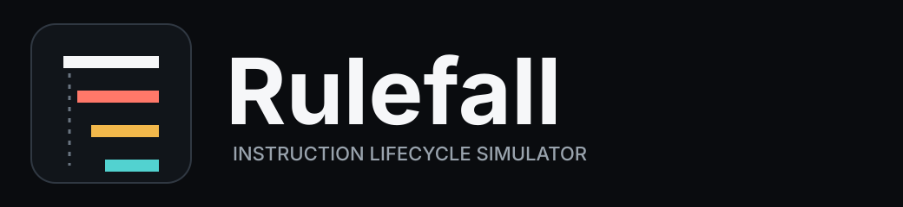
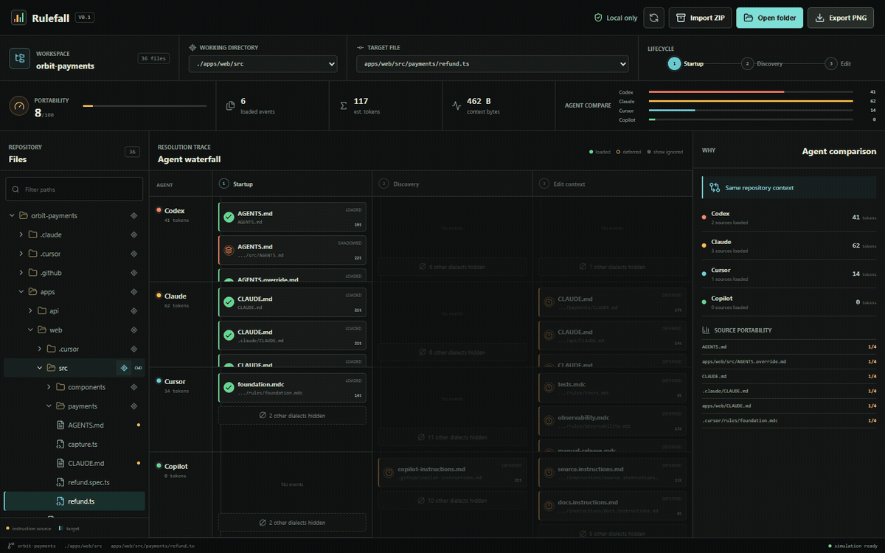

<div align="center">
  

  <h3>你的编程代理，读到的并不是同一个仓库。</h3>
  <p><strong>看清哪些指令会在何时、因何原因到达你的编程代理。</strong></p>

  <p>
    <a href="https://lyrazeta.github.io/rulefall/"><strong>计划中的在线模拟器</strong></a>
    · <a href="#快速开始">本地运行</a>
    · <a href="docs/SEMANTICS.md">语义说明</a>
    · <a href="README.md">English</a>
  </p>
</div>



仓库根目录的 `AGENTS.md`、子目录里的 `CLAUDE.md`、带 glob 的 Cursor rule，以及 Copilot 的路径指令，看起来都像“仓库上下文”。但不同代理发现它们的时间、作用域和处理方式并不相同。

**Rulefall 是一个交互式生命周期一致性模拟器。** 导入本地目录或 ZIP，选择工作目录和目标文件，再从启动、发现一路拖动到编辑阶段。Rulefall 会并排展示 Codex、Claude Code、Cursor 和 GitHub Copilot 的指令瀑布流，并解释每个来源何时被加载、延迟、忽略、遮蔽或截断。

无需上传仓库，无需调用模型 API，也无需安装任何编程代理。

## 为什么需要 Rulefall

现有工具通常回答：仓库里有哪些代理配置文件、配置是否合法、某条路径继承了哪些 `AGENTS.md`。Rulefall 则回答一个不同的问题：

> **对于当前生命周期阶段、工作目录和目标文件，每个代理究竟会收到什么，又错过什么？**

它适合在真实会话出现意外之前，发现跨代理迁移中的静默差异。

## 主要能力

- **生命周期时间轴**：分别观察 `startup`、`discovery` 和 `edit`，而不是把所有文件压成一份清单。
- **四代理并排对比**：同一仓库、同一目标下比较 Codex、Claude Code、Cursor 和 GitHub Copilot。
- **可解释事件**：每个事件都有来源、阶段、动作、原因和置信度。
- **目标感知**：切换工作目录和目标文件，观察局部指令如何进入或离开有效上下文。
- **可移植性信号**：发现只被少数代理识别的指令；该数值用于比较，不是质量评分。
- **本地输入**：可直接使用内置 `orbit-payments` 示例；浏览器支持时打开目录，否则导入 ZIP。
- **PNG 导出**：把当前瀑布流导出，用于 issue、评审或迁移讨论。图片可能包含工作区名称、仓库路径、所选上下文和可见的指令摘录。

## 快速开始

[在线模拟器](https://lyrazeta.github.io/rulefall/)计划通过 GitHub Pages 发布；现在可在本地运行：

```bash
git clone https://github.com/LyraZeta/rulefall.git
cd rulefall
corepack enable
pnpm install
pnpm dev
```

打开终端给出的本地地址。内置示例会立即显示；点击 **Open folder** 或 **Import ZIP** 分析自己的仓库。仓库读取和模拟均在浏览器本地完成。

导入会跳过常见依赖/构建目录和不支持的文件类型。安全上限为：单文件 1 MiB、已接收文本总量 32 MiB、1,500 个已接收文件、10,000 个已扫描条目；ZIP 压缩包最大 50 MiB，解压前会跳过压缩比超过 200:1 的可疑条目。因此，大型或特殊仓库的 trace 可能不完整；Rulefall 会保留可用部分，并显示汇总跳过内容的醒目警告。

提交前运行：

```bash
pnpm check
```

本地开发需要 Node.js 22.13 或更高版本。

## 如何理解结果

| 动作 | 在 Rulefall 中的含义 |
| --- | --- |
| `loaded` | 模拟代理识别该来源，且当前阶段和目标满足加载条件。 |
| `deferred` | 代理识别该来源，但当前时机或作用域尚未满足。 |
| `ignored` | 该来源属于其他指令方言，或不在当前建模范围内。 |
| `shadowed` | 更高优先级的来源在模型中取代了该来源。 |
| `truncated` | 该来源超出建模的加载或预览预算，只包含其中一部分。 |

置信度描述的是 **Rulefall 对某项产品语义的把握**，而不是指令文本质量，更不代表模型一定遵从：

- **Exact**：官方文档有明确、稳定的规则，模拟器直接实现该规则。
- **Conditional**：行为取决于产品模式、设置、匹配条件或运行时上下文。
- **Best effort**：厂商没有公开足够细节，Rulefall 使用公开、可检查的近似模型。

## v0.1 支持矩阵

| 代理 | 识别的仓库来源 | 生命周期模型 | 语义边界 |
| --- | --- | --- | --- |
| OpenAI Codex | `AGENTS.md`、`AGENTS.override.md` | 启动时处理仓库/根指令，发现工作范围时处理嵌套指令 | 建模目录作用域；override、备用文件名、字节上限和启动位置等细节保守标注。 |
| Claude Code | 仓库内的 `CLAUDE.md` | 启动时加载工作目录及祖先 memory；读取子目录文件时按需加载后代 memory | 建模仓库内发现；用户/托管 memory、import、auto-memory 和产品模式差异不在 v0.1 范围。 |
| Cursor | `.cursor/rules/*.mdc`；已弃用的根目录 `.cursorrules` | 根目录 always-on 规则在启动阶段处理，嵌套 always-on 规则在发现阶段处理，依赖目标的规则在编辑阶段处理；旧版根规则按启动阶段建模 | 建模 MDC 元数据和目标关系；代理请求/手动附加以及已弃用 `.cursorrules` 的行为均标为条件语义。 |
| GitHub Copilot | `.github/copilot-instructions.md`、`.github/instructions/*.instructions.md` | 发现仓库时处理仓库指令，知道目标后处理路径指令 | 建模仓库与路径目标；不同 Copilot 入口的支持范围不同，因此标为条件语义。 |

完整定义、排除项和证据见[语义与置信度](docs/SEMANTICS.md)和[官方资料索引](docs/REFERENCES.md)。产品行为会变化，资料页标注了最近复核日期。

## 与相邻项目的区别

| 项目 | 主要问题 | 核心能力 |
| --- | --- | --- |
| [agentoscope](https://github.com/rafaelcg/agentoscope) | 仓库里有哪些代理指令文件，它们可能占用多少上下文？ | 多格式清单、可视化报告和规则检查 |
| [Scopeglass](https://github.com/zackabrah/scopeglass) | 这条路径继承了哪些上级 `AGENTS.md`？ | 确定性继承、来源追踪、诊断和 CI 策略 |
| [agnix](https://github.com/agent-sh/agnix) | 代理配置是否合法、是否易维护？ | linter、自动修复、LSP、编辑器集成和规则库 |
| **Rulefall** | **每个代理会在何时加载、延迟、忽略、遮蔽或截断这条指令？** | **跨代理生命周期一致性模拟** |

Rulefall **不是**配置文件清单扫描器、文案 linter、IDE 语言服务器，也无法观察厂商隐藏的 system prompt。它不证明模型遵从了某条指令。严肃场景中，请把 Rulefall 与配置 linter、真实代理评测配合使用。

## 隐私

- 目录和 ZIP 内容只在浏览器内存中读取。
- Rulefall 不上传仓库内容。
- 应用没有分析统计、遥测、后端、账号系统或模型 API 调用。
- 导入的工作区不会由应用跨刷新持久化。
- 导入会限制单文件、总内容、条目数量、压缩包大小与压缩比；部分导入仍可使用，但会显示醒目警告，因此 trace 不代表完整仓库清单。
- PNG 导出可能包含工作区名称、工作目录、目标路径、仓库路径和可见的指令摘录，分享前请自行检查。

托管平台仍会收到静态资源的普通网络请求；浏览器扩展和被修改的部署也不在 Rulefall 控制范围内。分析敏感仓库前请阅读完整的[隐私模型](docs/PRIVACY.md)。

## 路线图

- **v0.1 — Waterfall**：本地导入、四代理比较、生命周期阶段、原因、置信度和 PNG 导出。
- **v0.2 — Semantic fixtures**：版本化厂商样例、更完整的 glob/frontmatter 计算、JSON trace。
- **v0.3 — Conformance lab**：记录真实代理观察结果，对比官方描述与实际行为，建立回归样例。
- **后续方向**：CLI/CI、更多代理、自定义厂商配置和隐私友好的团队基线。

路线图是方向，不是承诺。详见 [ROADMAP.md](docs/ROADMAP.md)。发现模拟结果与当前官方行为不一致时，请提交 [semantic gap](https://github.com/LyraZeta/rulefall/issues/new?template=semantic-gap.yml)。

## 常见问题

**Rulefall 能显示最终发给模型的完整 prompt 吗？**

不能。厂商的 prompt 组装过程部分保密，也可能随入口、版本、设置和会话变化。Rulefall 只模拟有公开证据的仓库指令语义，并明确标注不确定性。

**`loaded` 是否意味着模型遵从了指令？**

不是。指令送达、模型注意到、模型最终遵从是三个不同问题；Rulefall 只建模第一个。

**可以分析私有仓库吗？**

可以在本地分析。请在可信部署上使用 **Open folder** 或 **Import ZIP**。Rulefall 不需要 GitHub token 或仓库 URL。

## 文档

- [架构](docs/ARCHITECTURE.md)
- [语义与置信度](docs/SEMANTICS.md)
- [隐私模型](docs/PRIVACY.md)
- [官方资料索引](docs/REFERENCES.md)
- [路线图](docs/ROADMAP.md)
- [v0.1.0 发布说明](docs/releases/v0.1.0.md)
- [参与贡献](CONTRIBUTING.md)
- [安全策略](SECURITY.md)

欢迎参与贡献。涉及厂商语义的修改需要附带聚焦的样例或测试，并引用官方资料。Rulefall 使用 [MIT License](LICENSE) 开源。
