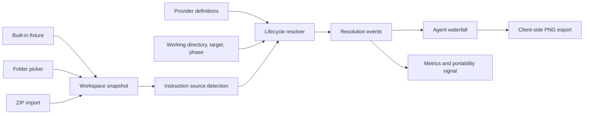

# Architecture

Rulefall is a static, client-side application that turns a repository snapshot and a simulated agent state into an explainable instruction-resolution trace.

## Data Model

A workspace is an in-memory name plus a list of repository-relative text files. The browser import layer skips common dependency/build directories and unsupported extensions, then enforces 1 MiB per file, 32 MiB total accepted text, 1,500 accepted files, and 10,000 scanned entries. ZIP input is capped at 50 MiB compressed and preflighted for unsafe paths, size metadata, and compression ratios above 200:1 before extraction. The resulting snapshot can therefore be incomplete; v0.1 preserves usable partial imports and surfaces summarized warnings rather than every skipped path.

The simulation input is:

- provider;
- workspace snapshot;
- working directory;
- target path;
- lifecycle phase (`startup`, `discovery`, or `edit`).

The output is an ordered list of resolution events. Each event records its provider, source path, action, phase, rule kind, byte/token estimates, human-readable reason, confidence, documentation reference, and excerpt.

## Design Properties

### Deterministic core

Given the same normalized workspace, working directory, target, phase, and provider definitions, the resolver should return the same event sequence. There are no model calls and no remote state in the simulation path.

### Provider differences stay visible

Rulefall does not convert every configuration format into an imaginary universal standard. Provider adapters share an event vocabulary, but filename recognition, scope, precedence, timing, and uncertainty remain provider-specific.

### Repository content is inert

Imported files are read as text. Rulefall must not evaluate scripts, HTML, Markdown, hooks, configuration expressions, or instructions found in the repository. The UI renders excerpts as text, not trusted markup.

### UI is an explanation layer

The waterfall and metrics are projections of resolution events. Semantic behavior belongs in the simulation layer rather than view components so it can be fixture-tested and later reused by a CLI or CI reporter.

## Known v0.1 Constraints

- The app recognizes a deliberately narrow set of repository instruction formats.
- Token counts are estimates, not provider tokenizer results.
- Browser folder access depends on the File System Access API; ZIP import is the portable fallback.
- The resolver does not observe a live agent or its private prompt assembly.
- Glob/frontmatter and provider-mode semantics are conservative in v0.1.
- PNG export captures the rendered comparison, including potentially sensitive workspace names, paths, selected context, and visible excerpts; it is not a cryptographically verifiable trace.

See [SEMANTICS.md](SEMANTICS.md) for the behavioral contract and [PRIVACY.md](PRIVACY.md) for trust boundaries.
